# 관통프로젝트: HappyHouse_DB_서울_07반_이혜진_최낙훈
### 제출일: 2020.10.16

### 참여 페어
- 이혜진, 최낙훈

### 처리된 요구사항 목록
  
|난이도|구현기능|세부|작성여부(O/X)|
|:---:|---|---|:---:|
|기본|메인페이지|O|
|기본|회원관리페이지|회원정보 등록화면|O|
|기본|회원관리페이지|회원정보 수정화면|O|
|기본|회원관리페이지|회원정보 삭제화면|O|
|기본|회원관리페이지|회원정보 검색화면|O|
|기본|회원관리페이지|비밀번호찾기|O|
|기본|로그인/로그아웃 페이지||O|
|기본|아파트 실거래가 검색,결과 페이지|전체검색화면|O|
|기본|아파트 실거래가 검색,결과 페이지|상세검색화면|O|
|기본|아파트 실거래가 검색,결과 페이지|동별화면|O|
|기본|아파트 실거래가 검색,결과 페이지|아파트별검색화면|O|
|기본|아파트 실거래가 데이타|DB에 데이타 구축|O|
|기본|주택 실거래가 데이타|DB에 데이타 구축|O|
|추가|관심지역 동네 업종 정보||X|
|추가|관심지역 대기 오염 정보||X|
|추가|관심지역 데이타 관리||X|
|심화|동네 환경 전검 정보 데이타 관리||X|
|심화|코로나 선별 진료소 정보 데이타 관리||X|
|심화|국가 안심 병원 정보 데이타 관리||X|
|심화|추가기능 |ex) 공지사항|X|

---

# 구현 기능
FrontEnd + BackEnd(Controller, Model(Dao, Service, Dto)

## 메인화면

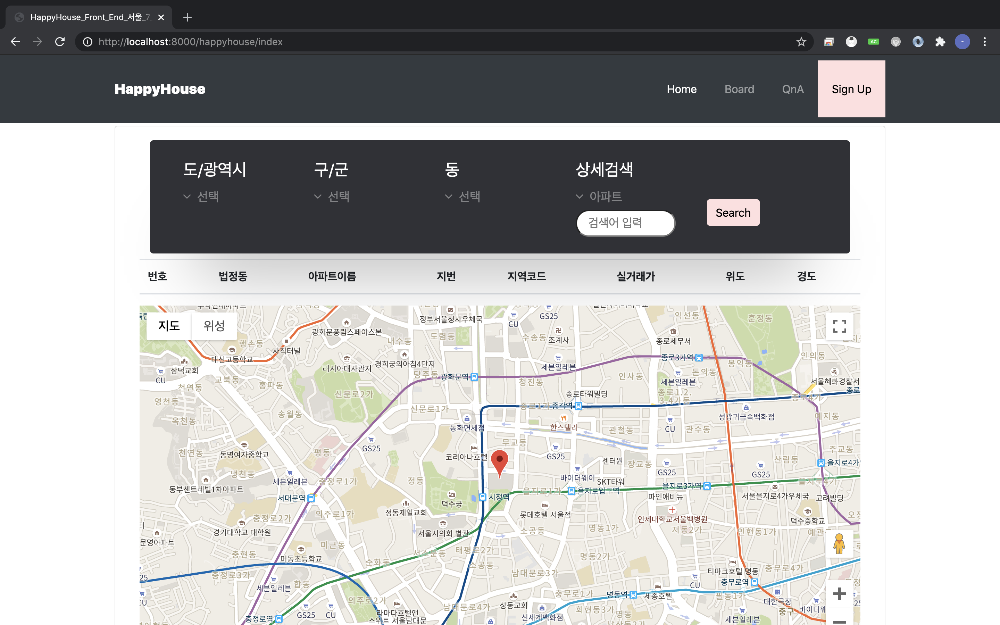

---

## 회원관리 페이지

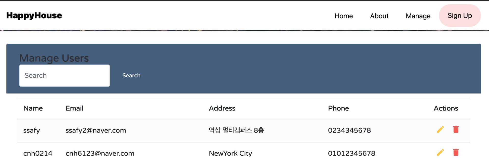

### 1. 회원정보 등록
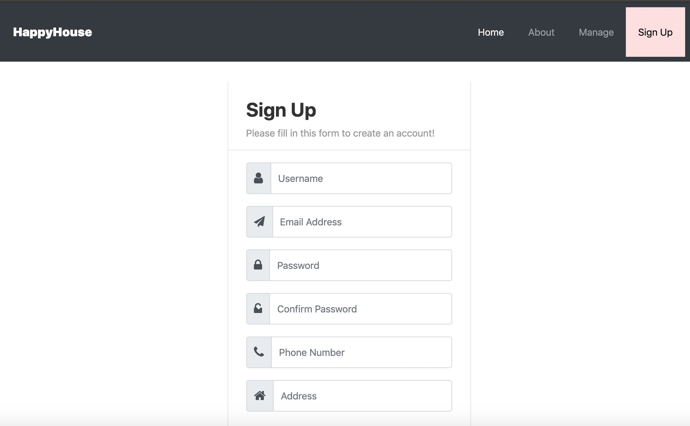

### 2. 회원정보 수정

### 수정 전
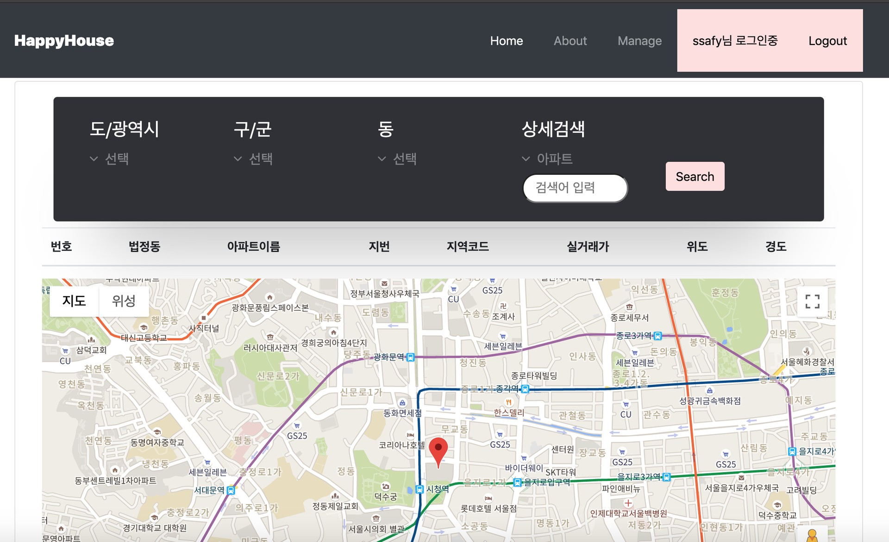

### 수정하는 화면
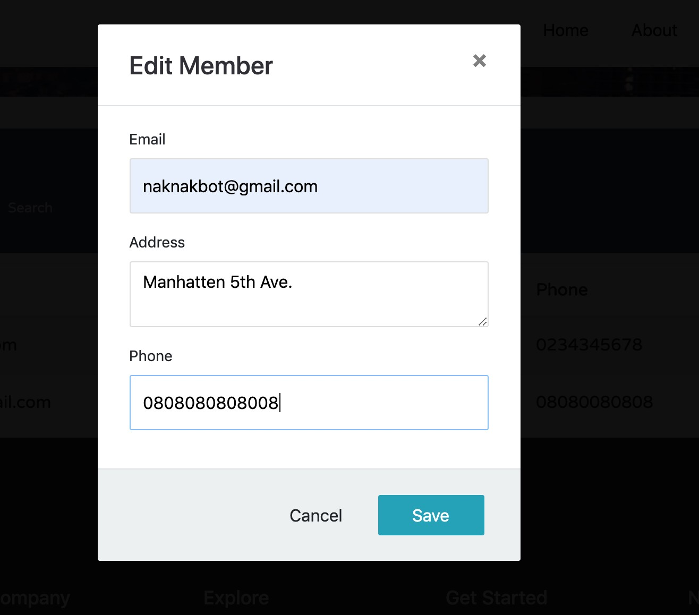

### 수정 후

### 3. 회원정보 삭제 (별도 창 없이 바로 삭제됨)
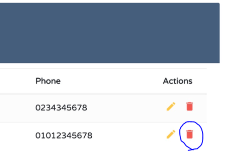

### 4. 회원정보 검색
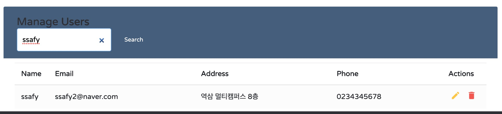

### 5. 비밀번호 찾기
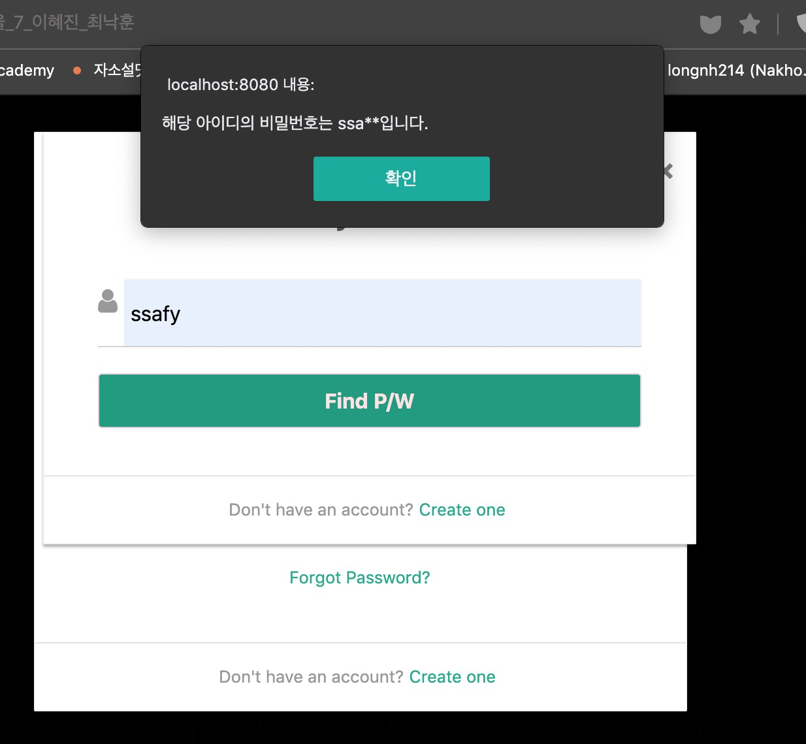

---

## 로그인/로그아웃

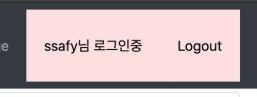

---

## 아파트 실거래가 검색,결과

### 1. 전체 검색
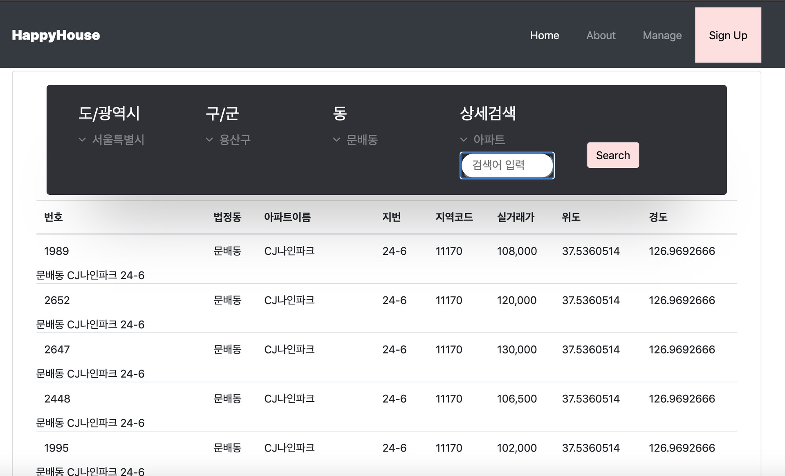

### 2. 상세 검색
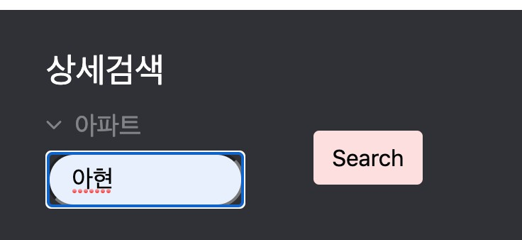

### 3. 동별 화면
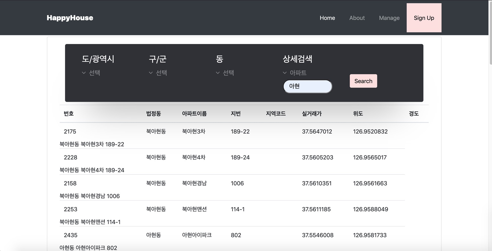

### 4. 아파트별 화면
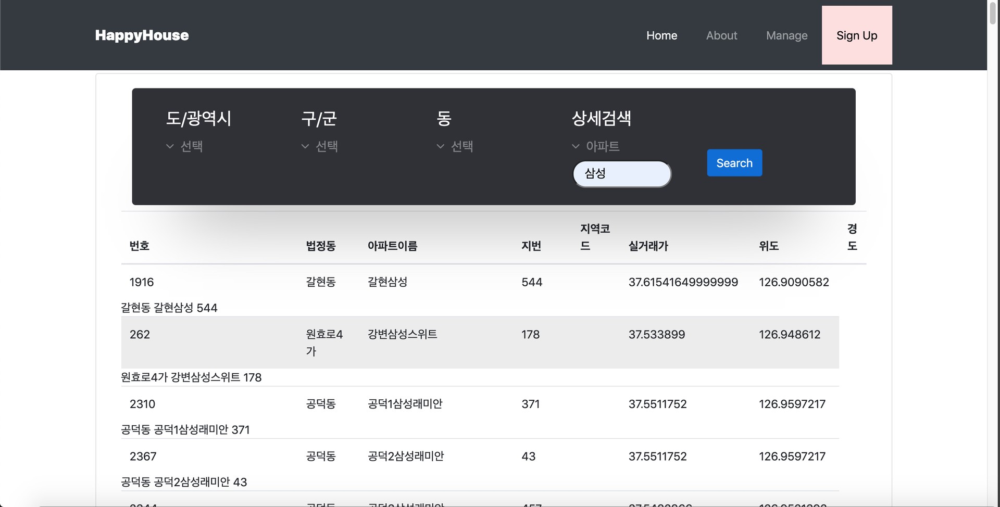

---

## 아파트 & 주택 실거래가 데이터 DB 구축

### JDBC로 xml 파일 불러오는 코드 구축
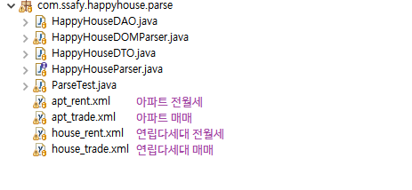

### sql table 구조
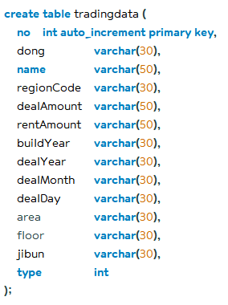

### 아파트 매매&전월세 데이터 (type 1, 2)

### 연립다세대 매매&전월세 데이터 (type 3, 4)

